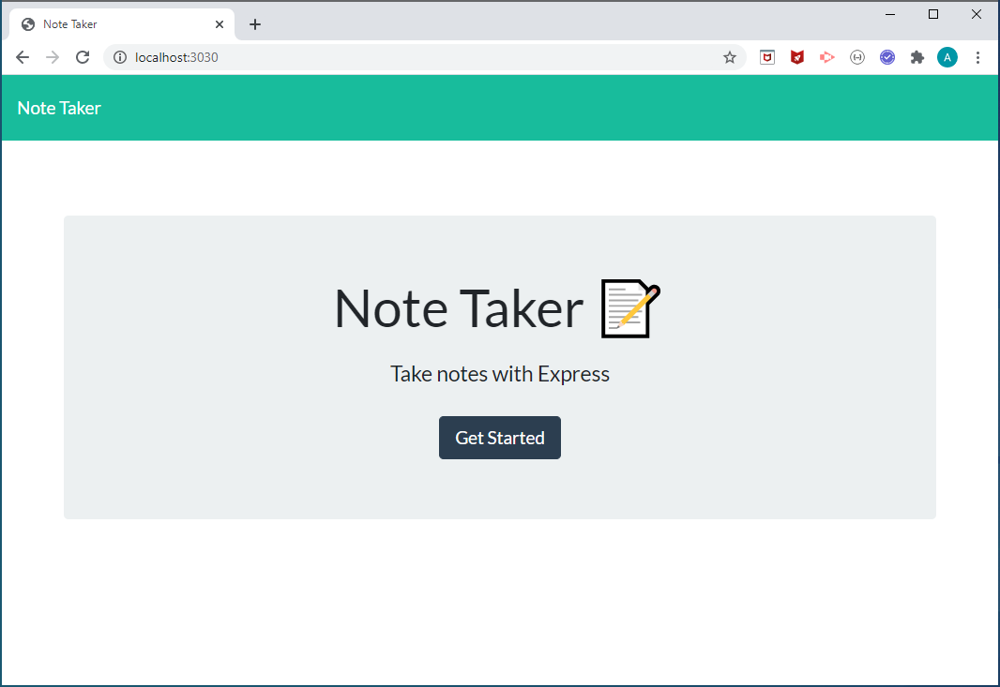
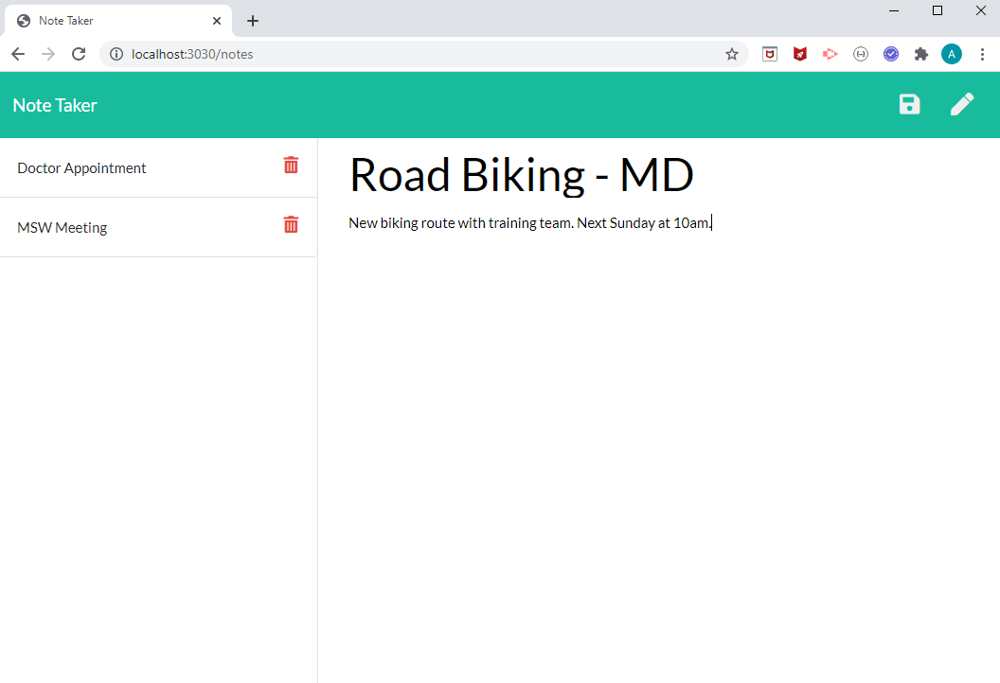
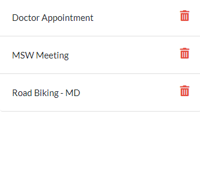
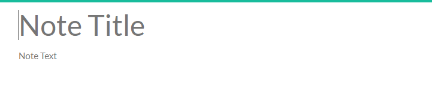

# Note_Taker



Links : [App at Heroku](https://cesaraugustomartinez.github.io/Template_Engine-Employee_Summary/video.html), [Repository](https://github.com/CesarAugustoMartinez/Note_Taker)

---

### Table of Contents

- [Description](#description)
- [How to Use](#how-to-use)
- [Screenshots](#screenshots)
- [References](#references)
- [License](#license)
- [Author Info](#author-info)

---

## Description

The goal of this project is cerate a application that can be used to write, save, and delete notes. This application will use an express backend and save and retrieve note data from a JSON file. This app was builded using NODE.js code to generate a dynamically html file and control API routes. 

##### Technologies

- JavaScript
- NPM Modules
- Visual Studio Code
- Node.js
- Package.json
- Html
- CSS
- EXPRESS

##### Code sample - JavaScript - Express 
#

```js
var express = require("express");
var path = require("path");

// Tells node that we are creating an "express" server
var app = express();

// Sets an initial port. We"ll use this later in our listener
var PORT = process.env.PORT || 3030

// Sets up the Express app to handle data parsing
app.use(express.urlencoded({ extended: true }));
app.use(express.json());
// What folder the browser can see
app.use(express.static(path.join(__dirname,"./public")));


// ROUTER
// The below points our server to a series of "route" files.
require("./routes/apiRoutes")(app);
require("./routes/htmlRoutes")(app);

// LISTENER
// The below code effectively "starts" our server
app.listen(PORT, function() {
  console.log("App listening on PORT: " + PORT);
});


```
##### Code sample - package.json
#
```json
 {
  "name": "note-taker",
  "version": "1.0.0",
  "description": "This application can be used to write, save, and delete notes",
  "main": "server.js",
  "scripts": {
    "test": "echo \"Error: no test specified\" && exit 1",
    "start": "node server.js"
  },
  "author": "",
  "license": "ISC",
  "dependencies": {
    "express": "^4.16.4",
    "fs": "0.0.1-security",
    "path": "^0.12.7",
    "util": "^0.12.3"
  }
}

```

##### Code sample - HTML routes
#
```js
// DEPENDENCIES
const path = require("path");

// ROUTING

module.exports = function(app) {
    // HTML GET Requests  
    app.get("/notes", function(req, res) {
      res.sendFile(path.join(__dirname, "../public/notes.html"));
    });
  
    // If no matching route is found default to home
    app.get("*", function(req, res) {
      res.sendFile(path.join(__dirname, "../public/index.html"));
    });
      
  };

```
---

## How To Use

This web application is running on a server. It has a principal html webpage where the user will click on GetStarted button to invoke the a new webpage. Once It has been invoked the page will have inputs for title, and data of the note. Then It can save, delete, or modify notes using the bottons on top of the page. 

[Back To The Top](#Note_Taker)
 
## Screenshots

- HTML page for enter notes.



- Notes List section. 



- Note Data section.



- Note nav and buttons


[Back To The Top](#Note_Taker)

---

## References

- w3school -- [Node.js NPM](https://www.w3schools.com/nodejs/nodejs_npm.asp)
- NPM -- [Node Package Managment](https://www.npmjs.com/)
- Express -- [Express module](https://www.npmjs.com/package/express)
- Node.js -- [About Node.js](https://nodejs.org/en/)
- json -- [The package.json guide](https://nodejs.dev/learn/the-package-json-guide)


[Back To The Top](#Note_Taker)

---

## License

Copyright (c) [2020] [Cesar A Martinez]

[Back To The Top](#Note_Taker)

---

## Author Info

- Twitter -- [@cesaguma](https://twitter.com/cesaguma)
- Linkedin -- [Cesar A Martinez](https://www.linkedin.com/in/cesar-augusto-martinez-auquilla-03934a16b/)
- GitHub -- [CesarAugustoMartinez](https://github.com/CesarAugustoMartinez)

[Back To The Top](#Note_Taker)
